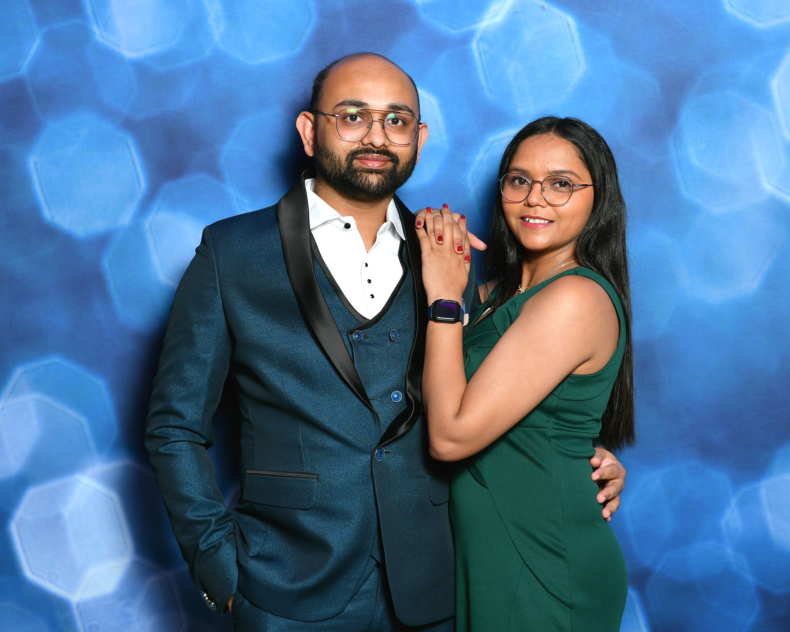

# Chiggi.us - Personal Website Implementation Plan

## 🎯 Project Overview

**Goal**: Create a modern, responsive, dynamic personal website for Chirag and Jiggi
**Hosting**: GitHub Pages
**Domain**: chiggi.us
**Theme**: Neumorphic design with light/dark mode toggle
**Tech Stack**: Vanilla HTML/CSS/JavaScript (no frameworks)

---

## 📐 Architecture & Design Strategy

### Core Principles
- **Mobile-First Responsive Design**: 320px → 768px → 1024px+
- **Single Page Application**: Dynamic tab switching without page reloads
- **Theme Persistence**: Light/dark mode saved to localStorage (default: light)
- **Content-Driven**: All text loaded from `config.json`
- **Performance Optimized**: Lazy loading, responsive images, minimal JavaScript
- **Accessible**: WCAG 2.1 AA compliant with keyboard navigation

### Responsive Breakpoints
```css
/* Mobile First (default) */
320px - 767px   → Single column, stacked layout, bottom nav
768px - 1023px  → 2-column grid, horizontal tabs
1024px+         → Full desktop layout, expanded spacing
```

---

## 🏗️ File Structure

```
chiggi_website/
├── index.html              ← Main HTML file
├── app.js                  ← JavaScript modules (config, theme, tabs, content)
├── config.json            ✅ Already exists
├── UI_Design_Update/      ✅ Already exists (complete neumorphic design system)
│   ├── neumorphic-ui.css
│   ├── core/variables.css
│   ├── themes/dark/dark-theme.css
│   └── components/
├── images/
│   ├── chirag_jiggi_main.jpg       ← Hero image (original)
│   ├── chirag_jiggi_main-320w.jpg  ← Mobile optimized
│   ├── chirag_jiggi_main-768w.jpg  ← Tablet optimized
│   └── chirag_jiggi_main-1200w.jpg ← Desktop optimized
├── favicon.ico
├── manifest.json          ← PWA manifest
├── CNAME                  ← Custom domain: chiggi.us
└── .gitignore
```

---

## 🎨 Page Structure & Content Design

### Header (Fixed Top)
- **Desktop**: Horizontal tab navigation (🏠 Home | 👨‍💻 Chirag | 👩‍🪔 Jiggi)
- **Mobile**: Bottom fixed navigation bar (icon + label)
- **Theme Toggle**: Top-right corner (☀️/🌙 icon) - neumorphic button

### Tab 1: 🏠 Home
**Layout**: Centered, vertical flow
```html
┌─────────────────────────────────┐
│   Hero Image (neumorphic card)  │
│   (max-width: 600px, centered)  │
├─────────────────────────────────┤
│  "Two hearts, one journey..."   │
│  With blessings of Sai Baba... │
├─────────────────────────────────┤
│   Description Paragraph         │
│   (neumorphic subtle card)      │
└─────────────────────────────────┘
```

**Content from config.json**:
- `home.hero_image` → Hero image
- `home.intro` → Poetic intro
- `home.description` → Main description
- `site.footer` → Blessing text

### Tab 2: 👨‍💻 Chirag
**Layout**: 2x2 Grid (desktop) | Stacked (mobile)
```html
┌──────────────┬──────────────┐
│  About Me    │  My Work     │  ← Neumorphic cards
├──────────────┼──────────────┤
│  Spiritual   │  Passions    │
└──────────────┴──────────────┘
```

**Sections**:
1. **About Me**: `chirag.about_me`
2. **My Work**: `chirag.my_work`
3. **Spiritual Side**: `chirag.spiritual_side`
4. **Passions & Projects**:
   - 🎵 Geet By Chirag (from `chirag.passions[0]`)
   - 🔧 ToolArc (from `chirag.passions[1]`)

**Grid CSS**:
```css
.card-grid {
  display: grid;
  grid-template-columns: repeat(2, 1fr);
  gap: 1.5rem;
}

@media (max-width: 767px) {
  .card-grid {
    grid-template-columns: 1fr;
  }
}
```

### Tab 3: 👩‍🪔 Jiggi
**Layout**: Intro + 5 Cards (responsive grid)
```html
┌─────────────────────────────────┐
│   Poetic Intro (centered)       │
├───────────┬───────────┬─────────┤
│  Card 1   │  Card 2   │ Card 3  │  ← Neumorphic cards
├───────────┴───────────┴─────────┤
│     Card 4      │     Card 5    │
└─────────────────┴───────────────┘
```

**Sections** (from `jiggi.sections[]`):
1. Who I Am
2. What Makes Me Smile
3. Faith & Devotion
4. Our Journey
5. Dreams & Hopes

**Grid CSS**:
```css
.jiggi-sections {
  display: grid;
  grid-template-columns: repeat(auto-fit, minmax(250px, 1fr));
  gap: 1.5rem;
}
```

**Styling**: Softer colors, gentle shadows, feminine touch

### Footer (Fixed Bottom)
- Blessing text: `site.footer`
- Centered, subtle text color
- Always visible on all tabs

---

## 💻 JavaScript Architecture

### Module Structure (app.js)

#### 1. ConfigLoader
```javascript
class ConfigLoader {
  async load() {
    const response = await fetch('config.json');
    return await response.json();
  }
}
```

#### 2. ThemeManager
```javascript
class ThemeManager {
  constructor() {
    this.currentTheme = localStorage.getItem('theme') || 'light';
    this.init();
  }

  init() {
    document.body.setAttribute('data-theme', this.currentTheme);
  }

  toggle() {
    this.currentTheme = this.currentTheme === 'light' ? 'dark' : 'light';
    document.body.setAttribute('data-theme', this.currentTheme);
    localStorage.setItem('theme', this.currentTheme);
  }
}
```

**Features**:
- Default: Light theme
- Persists to localStorage
- Smooth CSS transition (0.3s)
- Toggle button with icon change

#### 3. TabRouter
```javascript
class TabRouter {
  constructor() {
    this.currentTab = window.location.hash.slice(1) || 'home';
  }

  showTab(tabName) {
    // Hide all tabs
    document.querySelectorAll('.tab-content').forEach(tab => {
      tab.classList.remove('active');
    });

    // Show selected tab with fade-in
    document.getElementById(tabName).classList.add('active');
    window.location.hash = tabName;
  }
}
```

**Features**:
- URL hash routing (#home, #chirag, #jiggi)
- Browser back/forward support
- Smooth fade transitions
- Active tab highlighting

#### 4. ContentRenderer
```javascript
class ContentRenderer {
  render(config) {
    // Inject config data into DOM using data-content attributes
    document.querySelectorAll('[data-content]').forEach(el => {
      const path = el.getAttribute('data-content');
      el.textContent = this.getNestedValue(config, path);
    });
  }

  getNestedValue(obj, path) {
    return path.split('.').reduce((acc, key) => acc[key], obj);
  }
}
```

---

## 🎯 Theme System Implementation

### CSS Variables (from UI_Design_Update)
```css
/* Light Theme (default) */
[data-theme="light"] {
  --neu-base: #e0e5ec;
  --neu-text: rgba(0, 0, 0, 0.87);
  --neu-accent: #4a9eff;
}

/* Dark Theme */
[data-theme="dark"] {
  --neu-base: #2c2c2c;
  --neu-text: rgba(255, 255, 255, 0.95);
  --neu-accent: #4a9eff;
}

/* Smooth transition */
body {
  transition: background 0.3s ease, color 0.3s ease;
}
```

### Theme Toggle Button
- **Position**: Fixed top-right (desktop) | bottom-right (mobile)
- **Icon**: ☀️ (light mode) | 🌙 (dark mode)
- **Style**: Neumorphic button with hover effect
- **Accessibility**: `aria-label="Toggle theme"`

---

## 📱 Responsive Design Strategy

### Mobile (320px - 767px)
- Single column layout
- Bottom fixed navigation (thumb-friendly)
- Full-width cards with margin
- Larger touch targets (min 44px)
- Simplified spacing

### Tablet (768px - 1023px)
- 2-column card grid
- Horizontal tab navigation
- Medium spacing

### Desktop (1024px+)
- Full grid layouts
- Hover effects enabled
- Expanded spacing
- Max-width container (1200px)

### Key Techniques
```css
/* Fluid Typography */
h1 { font-size: clamp(1.5rem, 4vw, 2.5rem); }

/* Responsive Images */
img {
  width: 100%;
  height: auto;
  object-fit: cover;
}

/* Mobile-First Media Queries */
@media (min-width: 768px) { /* Tablet */ }
@media (min-width: 1024px) { /* Desktop */ }
```

---

## ⚡ Performance Optimization

### Image Optimization
```html

```

### Loading Strategy
1. **Critical CSS** → Inline in `<head>`
2. **Deferred JS** → `<script defer src="app.js">`
3. **Lazy Images** → `loading="lazy"` attribute
4. **Async Config** → `fetch('config.json')` on load

### Caching
- **Theme preference** → localStorage
- **Config data** → Session cache (optional)
- **Static assets** → Browser cache headers

### Target Metrics
- Lighthouse Performance: **>90**
- First Contentful Paint: **<1.5s**
- Time to Interactive: **<3.5s**
- Total Bundle Size: **<500KB**

---

## ♿ Accessibility Standards

### WCAG 2.1 AA Compliance
✅ **Semantic HTML**: `<header>`, `<nav>`, `<main>`, `<section>`, `<footer>`
✅ **Keyboard Navigation**:
- Tab key: Move between elements
- Arrow keys: Switch tabs
- Enter/Space: Activate buttons

✅ **ARIA Attributes**:
```html
<nav role="tablist" aria-label="Main navigation">
  <button role="tab" aria-selected="true">Home</button>
  <button role="tab" aria-selected="false">Chirag</button>
  <button role="tab" aria-selected="false">Jiggi</button>
</nav>
```

✅ **Color Contrast**: Minimum 4.5:1 ratio
✅ **Focus Indicators**: Visible outline on all interactive elements
✅ **Alt Text**: Descriptive text for all images
✅ **Screen Reader Support**: Proper headings and landmarks

---

## 🔍 SEO & Meta Tags

### Essential Meta Tags
```html
<head>
  <meta charset="UTF-8">
  <meta name="viewport" content="width=device-width, initial-scale=1.0">
  <title>Chiggi.us - Chirag & Jiggi's Journey Together</title>
  <meta name="description" content="Two hearts, one journey - Chirag and Jiggi's personal website sharing their life, faith, and love with blessings of Sai Baba and Bal Krishna.">

  <!-- Open Graph (Social Media) -->
  <meta property="og:title" content="Chiggi.us - Our Journey Together">
  <meta property="og:description" content="With blessings of Shirdi Sai Baba & Bal Krishna">
  <meta property="og:image" content="https://chiggi.us/images/chirag_jiggi_main.jpg">
  <meta property="og:url" content="https://chiggi.us">
  <meta property="og:type" content="website">

  <!-- Twitter Card -->
  <meta name="twitter:card" content="summary_large_image">
  <meta name="twitter:title" content="Chiggi.us - Our Journey">
  <meta name="twitter:description" content="Two hearts, one journey">
  <meta name="twitter:image" content="https://chiggi.us/images/chirag_jiggi_main.jpg">

  <!-- Favicon -->
  <link rel="icon" type="image/png" href="favicon.ico">
  <link rel="apple-touch-icon" href="apple-touch-icon.png">
</head>
```

### Structured Data (JSON-LD)
```html
<script type="application/ld+json">
{
  "@context": "https://schema.org",
  "@type": "WebSite",
  "name": "Chiggi.us",
  "url": "https://chiggi.us",
  "description": "Chirag and Jiggi's personal website"
}
</script>
```

---

## 🚀 Deployment Strategy

### GitHub Pages Setup
1. **Repository**: https://github.com/durgesh0505/chiggi_website
2. **Branch**: main (deployment source)
3. **URL**: https://durgesh0505.github.io/chiggi_website
4. **Custom Domain**: chiggi.us

### Custom Domain Configuration
**File**: `CNAME`
```
chiggi.us
```

**DNS Settings** (at domain registrar):
```
Type    Name    Value
A       @       185.199.108.153
A       @       185.199.109.153
A       @       185.199.110.153
A       @       185.199.111.153
CNAME   www     durgesh0505.github.io
```

### Deployment Commands
```bash
# Initial commit
git add .
git commit -m "🚀 Initial deployment: Chiggi.us personal website"
git push origin main

# GitHub Pages auto-deploys from main branch
# Enable in repo Settings → Pages → Source: main branch
```

### SSL/HTTPS
- Automatically provided by GitHub Pages
- Enable "Enforce HTTPS" in repository settings

---

## 🧪 Testing Checklist

### Cross-Browser Testing
- ✅ Chrome (latest)
- ✅ Firefox (latest)
- ✅ Safari (latest)
- ✅ Edge (latest)
- ✅ Mobile Safari (iOS)
- ✅ Chrome Mobile (Android)

### Responsive Testing
- ✅ iPhone SE (320px)
- ✅ iPhone 12/13 (390px)
- ✅ iPad (768px)
- ✅ iPad Pro (1024px)
- ✅ Desktop (1440px)
- ✅ Large Desktop (1920px)

### Functional Testing
- ✅ Tab navigation (click + keyboard)
- ✅ Theme toggle (persist across sessions)
- ✅ Config.json loading
- ✅ URL hash routing (browser back/forward)
- ✅ Image lazy loading
- ✅ Responsive images (different sizes)

### Accessibility Testing
- ✅ Keyboard navigation (Tab, Enter, Arrow keys)
- ✅ Screen reader (NVDA/VoiceOver)
- ✅ Color contrast (WCAG AA)
- ✅ Focus indicators visible
- ✅ ARIA labels present

### Performance Testing
- ✅ Lighthouse audit (Performance >90)
- ✅ PageSpeed Insights
- ✅ WebPageTest (Load time <3s)
- ✅ Image optimization check

---

## 📋 Implementation Phases

### Phase 1: Foundation (2-3 hours)
1. Create `index.html` with semantic structure
2. Link `UI_Design_Update/neumorphic-ui.css` (includes all components and utilities)
3. Setup `app.js` module structure
4. Create `images/` folder with placeholder
5. Use existing neumorphic components and layout utilities (no custom CSS needed)

### Phase 2: Core Functionality (3-4 hours)
1. Implement `ConfigLoader` class
2. Build `ThemeManager` with localStorage
3. Create `TabRouter` with URL hash support
4. Implement `ContentRenderer` for dynamic data
5. Add responsive navigation (desktop/mobile)

### Phase 3: Content Sections (2-3 hours)
1. **Home Tab**: Hero image + intro + description
2. **Chirag Tab**: 4-card grid with passions
3. **Jiggi Tab**: 5-section card layout
4. **Footer**: Blessing text
5. Style all with neumorphic theme

### Phase 4: Polish & Optimization (2-3 hours)
1. Responsive image optimization (srcset)
2. Add animations and transitions
3. Implement accessibility features (ARIA, keyboard)
4. Add SEO meta tags and structured data
5. Performance optimization (lazy load, defer)

### Phase 5: Deployment (1 hour)
1. Create `.gitignore`, `CNAME`, `manifest.json`
2. Git commit and push to GitHub
3. Enable GitHub Pages in settings
4. Configure DNS for custom domain
5. Cross-browser testing and fixes
6. Lighthouse audit and final optimizations

**Total Estimated Time**: 10-14 hours

---

## 🎯 Success Criteria

### Performance
- ✅ Lighthouse Performance Score: **>90**
- ✅ First Contentful Paint: **<1.5s**
- ✅ Total Blocking Time: **<300ms**
- ✅ Cumulative Layout Shift: **<0.1**

### Functionality
- ✅ All tabs load correctly from config.json
- ✅ Theme toggle works and persists
- ✅ Responsive on all breakpoints
- ✅ Smooth animations and transitions

### Accessibility
- ✅ WCAG 2.1 AA compliant
- ✅ Keyboard navigable
- ✅ Screen reader friendly
- ✅ Color contrast ratio >4.5:1

### SEO
- ✅ Meta tags complete
- ✅ Structured data implemented
- ✅ Open Graph tags for social sharing
- ✅ Sitemap and robots.txt

### Cross-Browser
- ✅ Works on Chrome, Firefox, Safari, Edge
- ✅ Mobile Safari and Chrome Mobile tested
- ✅ No console errors
- ✅ Consistent experience across browsers

---

## 🔮 Future Enhancements (Post-Launch)

### Phase 2 Features
- 📸 Photo gallery section
- 📝 Blog/Journal section
- 📧 Contact form
- 🎵 Embedded music player (Geet By Chirag)
- 🔗 Social media integration

### Advanced Features
- 🌐 Multi-language support (English/Gujarati)
- 📊 Analytics integration (privacy-friendly)
- 💬 Guestbook/Comments
- 🎨 Custom cursor effects
- 🎭 Advanced animations (GSAP)

### Technical Improvements
- ⚡ Service Worker for offline support
- 📦 Build system (Vite/Parcel) for optimization
- 🧪 Automated testing (Playwright)
- 🔄 CI/CD pipeline for auto-deployment

---

## 📚 Resources & Documentation

### Design System
- UI_Design_Update README: `/UI_Design_Update/README.md`
- Neumorphic components reference
- Color variables and theming guide

### External Resources
- [GitHub Pages Docs](https://docs.github.com/en/pages)
- [WCAG 2.1 Guidelines](https://www.w3.org/WAI/WCAG21/quickref/)
- [Web.dev Performance](https://web.dev/vitals/)
- [MDN Web Docs](https://developer.mozilla.org/)

### Tools
- Lighthouse (Chrome DevTools)
- WebPageTest
- WAVE Accessibility Checker
- Image optimization: Squoosh.app

---

## 📝 Notes

- Keep config.json editable for easy content updates
- Maintain neumorphic design consistency across all elements
- Prioritize mobile experience (majority of users)
- Test theme toggle thoroughly across all tabs
- Ensure spiritual/cultural elements are respectfully presented
- Keep the tone warm, personal, and heartfelt

---

**Plan Created**: October 2025
**Next Action**: Begin Phase 1 implementation with index.html structure
